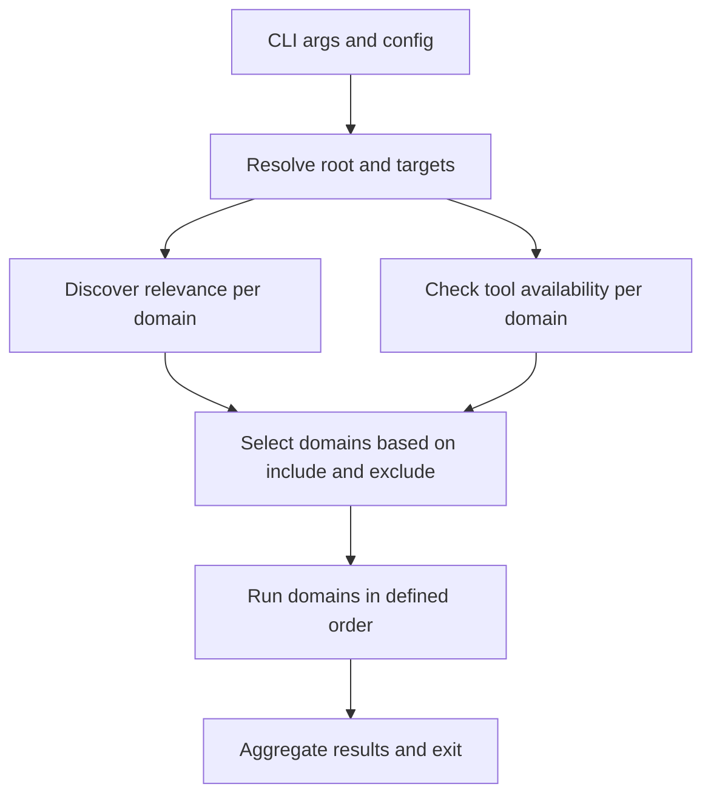

# Refactor epic plan: smart detection + domain architecture

## Objective

Refactor `matrixai-lint` into a domain-oriented lint engine that:

- Performs smart auto-discovery (project relevance) independently from tool availability.
- Distinguishes built-in npm-based capabilities (for example ESLint/Prettier) from optional external tools (for example ShellCheck, nixfmt).
- Supports explicit domain selection (include/exclude/only) with consistent target semantics.
- Provides clean extension points for adding new domains.

## Non-goals

- No behavior-changing implementation in this epic document (this is design/spec only).
- No changes to the shipped ESLint ruleset content (rule tuning is out of scope).
- No attempt to fully replace ESLint/Prettier/ShellCheck/nixfmt; this project orchestrates them.

## Constraints / invariants

- Must remain usable downstream via `matrixai-lint` and `matrixai-lint --fix`.
- Built-in JS/TS linting and Markdown formatting must work with only npm dependencies installed.
- External-tool domains must be safe to auto-skip when tools are absent, unless explicitly requested.
- No edits to non-markdown source files in this subtask.

## Docs map

- [`PLAN.md`](PLAN.md): design/spec and phased refactor plan.
- [`STATE.md`](STATE.md): current state, open questions, next actions.

## Decomposition rule

If this plan grows beyond a workable single-document size, split into numbered docs (for example `10-cli.md`, `20-config.md`) and keep [`PLAN.md`](PLAN.md) as the index.

## Current reality lives in

- [`STATE.md`](STATE.md)

---

## Problem statement

Current `matrixai-lint` behavior (as implemented today) has several structural issues:

- **Fixed domain sequence**: ESLint then shellcheck then Markdown/Prettier; users cannot explicitly select domains.
- **Targeting does not imply selection**: `--eslint` narrows ESLint scope but does not prevent other domains from running.
- **Inconsistent shell semantics**: `--shell` is described as glob(s) but is treated as existing search roots/paths.
- **Default scope is overly coupled** to `cwd` and a single `tsconfig`-driven include/exclude interpretation.
- **Extensibility constraints**: no clean, explicit domain interface; adding domains requires cross-cutting changes.
- **Missing-tool behavior** is ad-hoc: optional external tools are not modeled as first-class capabilities.
- **Unknown options are silently ignored** instead of failing fast, making typos and accidental misuse hard to detect.
- **Multi-tsconfig behavior is inconsistent**: target pattern derivation and parser project inputs are not aligned.
- **Error aggregation is fragile**: an early return path can mask already-recorded failures, and thrown domain errors can bypass unified summary output.
- **Glob synthesis can be malformed** when tsconfig include entries already carry file extensions and wrapper logic appends another extension suffix.
- **Repo scripts bias exercised behavior** by always passing both ESLint and shell roots, so domain-only workflows are under-validated.

Downstream impact: consumers may not have optional external tools installed, but should still get reliable built-in linting/formatting.

## Design goals

1. **Make domains first-class**: discover, select, configure, run, and report per domain.
2. **Separate relevance from availability**: do not confuse "this repo has shell scripts" with "shellcheck exists".
3. **Consistent targeting**: every domain must interpret targets the same way (paths/globs anchored at a well-defined root).
4. **Predictable missing-tool semantics**: optional tools skip with warning when auto-selected, but fail when explicitly requested.
5. **Backwards compatibility**: preserve the common experience for `matrixai-lint` and `matrixai-lint --fix`, while enabling a richer CLI.
6. **Extensibility**: add domains without modifying core orchestration logic.
7. **Deterministic failure reporting**: always aggregate and summarize all executed-domain outcomes with no silent success paths.
8. **Strict option correctness**: unknown flags must fail by default with actionable diagnostics.
9. **Multi-project correctness**: file targeting and parser project configuration must be aligned for all configured tsconfig entries.

---

## Smart detection model: project relevance vs tool availability

Each domain evaluation is the product of two independent assessments:

### 1) Project relevance

"Should we lint/format this domain in this project (or this target set)?"

Examples of relevance signals:

- ESLint (JS/TS): any `*.{js,mjs,cjs,jsx,ts,tsx,mts,cts,json}` in the target set.
- Markdown/Prettier: any `*.{md,mdx}` in the target set (plus `README.md` by convention).
- ShellCheck: any `*.sh` in the target set.
- Nixfmt: any `*.nix` in the target set.

Relevance must be computed against the *effective target set* (CLI paths/globs + config defaults), not against the whole filesystem blindly.

### 2) Tool availability

"Do we have the tools required to run this domain right now?"

Availability is domain-specific:

- **Built-in npm-based** domains (ESLint, Prettier) are expected to be available whenever `@matrixai/lint` is installed.
- **External optional** domains (ShellCheck, nixfmt) may not exist in downstream environments.

### Decision matrix

- If **relevant + available**: run domain.
- If **relevant + unavailable**:
  - If domain was **auto-selected**: skip with warning.
  - If domain was **explicitly requested**: fail with a "missing tool" error.
- If **not relevant**:
  - If auto-selected: skip silently (or with `--verbose` explain).
  - If explicitly requested: run as a no-op that reports "no files matched" (default success), unless a domain opts into strictness.

This model explicitly distinguishes "capability exists" from "domain matters".

---

## Proposed domain/plugin architecture

### High-level components

- **Lint engine**: parses CLI/config, computes target set, selects domains, orchestrates execution, aggregates results.
- **Domain plugins**: encapsulate discovery, tool checks, execution, and reporting for one domain.
- **Capability registry**: standardizes dependency checks (npm module resolution vs external binary lookup).

### Domain plugin interface (conceptual)

Each domain plugin should define:

- `id`: stable string identifier (for example `eslint`, `shellcheck`).
- `discover(ctx)`: returns relevance result and default target patterns for this domain.
- `dependencies(ctx)`: declares required and optional dependencies.
- `run(ctx, targets, mode)`: executes the domain toolchain and returns a normalized result.
- `supportsFix`: whether `--fix` can be applied.

The engine is responsible for:

- Converting CLI/config selection into a domain run list.
- Applying the missing-tool policy based on dependency classification and explicit request state.
- Rendering consistent output and a final exit code.

### Built-in domains (minimum)

1. **eslint**
   - Built-in npm-based capability.
   - Type-aware TS linting when tsconfig information is available.
2. **markdown-prettier**
   - Built-in npm-based capability.
   - Formats/checks Markdown and MDX.
3. **shellcheck**
   - External optional tool.
   - Lints `*.sh`.
4. **nixfmt**
   - External optional tool.
   - Formats/checks `*.nix`.

### Mermaid: selection and execution pipeline



---

## Dependency classification and missing-tool semantics

### Dependency categories

Dependencies are classified at evaluation time:

1. **Required**
   - Always required for a domain to run.
   - Missing is a fatal error.
   - Example: ESLint runtime modules for the `eslint` domain.

2. **Optional**
   - Not required for the overall command when the domain is auto-selected.
   - Missing results in a skip-with-warning.
   - Example: `shellcheck` binary for the `shellcheck` domain.

3. **Explicitly-requested-required**
   - Any optional dependency becomes required if the user explicitly requests the domain.
   - Missing results in a fatal error with clear remediation.

### Policy rules

- **Auto-discovery must never fail the command** due solely to missing optional external tools.
- **Explicit domain selection must be strict**: if a user asks for `shellcheck` or `nixfmt`, and the tool is missing, exit non-zero.
- Provide an actionable error message (what is missing, how the tool was detected, how to install).

---

## New CLI model: targeted linting + domain inclusion/exclusion

### Proposed flags (vNext)

Core:

- `matrixai-lint [targets...]` where `targets` are paths and/or globs.
- `--fix` apply fixes for domains that support fixes.
- `--domain <id...>` run only these domains (explicit request).
- `--skip-domain <id...>` exclude domains from auto-run.
- `--list-domains` print available domain IDs and brief descriptions.
- `--explain` print why each domain ran or was skipped (relevance and availability).

ESLint-specific (kept, but clarified):

- `--eslint <glob...>` override ESLint targets (implicitly requests the `eslint` domain).
- `--eslint-config <path>` explicit ESLint config override (alias: legacy `--config`).
- `--user-config` keep current meaning for ESLint config discovery.

ShellCheck-specific:

- `--shell <glob-or-path...>` rename or redefine in a consistent way.
  - Preferred: treat values as targets (same as positional targets) and match `*.sh` within them.
  - Back-compat: if values are directories, treat as roots; if globs, expand to files.

Markdown/Prettier-specific:

- Optional future: `--markdown <glob...>` to override markdown targets.

Nixfmt-specific:

- Optional future: `--nix <glob...>` to override nix targets.

### Selection precedence

1. If `--domain` is provided: run only those domains (strict missing-tool behavior).
2. Else: auto-discover relevant domains.
3. Apply `--skip-domain` exclusions.
4. Domain-specific target overrides (for example `--eslint`, `--shell`) implicitly request that domain even if relevance would be otherwise false.

### Unknown option policy and pass-through model

- Default behavior should reject unknown CLI options with usage/config error exit (`2`).
- Wrapper-level pass-through should not rely on silent unknown-option acceptance.
- If pass-through is needed, introduce explicit scoped flags (for example domain-specific extra args) instead of blanket unknown forwarding.
- During migration, unknown options can emit deprecation warnings for one release window before strict rejection is enforced.

---

## Config schema proposal (v2) + examples + extension points

### File discovery

Continue to support `matrixai-lint-config.json`, but evolve it to a versioned schema.

- If `version` is absent: treat as v1 (today) with top-level `tsconfigPaths` and `forceInclude`.
- If `version: 2`: enable the domain-aware schema.

### v2 shape (conceptual)

```json
{
  "version": 2,
  "root": ".",
  "defaults": {
    "targets": ["."],
    "ignore": ["node_modules/**", "dist/**"]
  },
  "domains": {
    "eslint": {
      "enabled": "auto",
      "tsconfigPaths": ["./tsconfig.json"],
      "forceInclude": ["scripts"],
      "config": {
        "useUserConfig": false,
        "overrideConfigPath": null
      }
    },
    "markdown-prettier": {
      "enabled": "auto",
      "targets": ["README.md", "docs/**/*.{md,mdx}"]
    },
    "shellcheck": {
      "enabled": "auto",
      "targets": ["src/**/*.sh", "scripts/**/*.sh", "tests/**/*.sh"],
      "tool": {
        "command": "shellcheck"
      }
    },
    "nixfmt": {
      "enabled": "auto",
      "targets": ["**/*.nix"],
      "tool": {
        "command": "nixfmt"
      }
    }
  },
  "plugins": [
    { "module": "./lint-domains/custom-domain.mjs" }
  ]
}
```

Notes:

- `enabled` supports: `auto` | `on` | `off`.
- `plugins` is the extension point: additional domain modules can be loaded to register domains.
- Domain `tool.command` allows a configurable executable name/path for external tools.

### Backward compatibility (v1)

Existing v1 config:

```json
{
  "tsconfigPaths": ["./tsconfig.json"],
  "forceInclude": ["scripts"]
}
```

Mapping rule:

- v1 maps to v2 `domains.eslint.tsconfigPaths` and `domains.eslint.forceInclude`.

### Target normalization and tsconfig alignment rules

- If multiple tsconfig paths are configured, file-target derivation must treat them as a union, not only the first entry.
- Include pattern normalization must be extension-aware:
  - extensionless include entries may have language extensions expanded
  - extension-bearing include entries must be preserved as-is.
- Parser project inputs and wrapper-level file targets must be derived from the same normalized tsconfig set.

---

## Execution semantics

### Ordering

Define a stable default domain order for readability and compatibility, while allowing explicit ordering in config:

1. `eslint`
2. `shellcheck`
3. `markdown-prettier`
4. `nixfmt`

### Exit codes

Proposed exit codes (subject to validation with downstream CI expectations):

- `0`: all executed domains succeeded; skipped domains were only skipped for non-fatal reasons.
- `1`: lint/format violations found in at least one executed domain.
- `2`: usage/config error (invalid flags, invalid config file, unknown domain ID).
- `3`: missing required tool or missing optional tool for an explicitly requested domain.
- `4`: unexpected internal error.

If downstream requires a single non-zero code, document that any non-zero is failure; the specific code is for diagnosis.

### Warnings vs errors

- Skipping auto-selected optional-tool domains emits a warning but does not fail.
- Explicitly requested domains missing tools emit an error and fail.
- Provide a final summary that lists executed, skipped, and failed domains.

### Aggregation invariants

- The command must never return before final outcome aggregation and summary emission.
- Domain exceptions must be normalized into domain failure records so the summary still prints once.
- Final process exit must be decided exactly once from aggregated domain outcomes and usage/config validation results.

---

## Command behavior matrix

Assume the project contains `src/**/*.ts`, `docs/**/*.md`, `scripts/foo.sh`, and `nix/shell.nix`.

| Invocation | Domain selection intent | Expected executed domains | If `shellcheck` missing | If `nixfmt` missing |
| --- | --- | --- | --- | --- |
| `matrixai-lint` | auto | eslint, markdown-prettier, shellcheck, nixfmt (if relevant) | shellcheck skipped with warning | nixfmt skipped with warning |
| `matrixai-lint --fix` | auto + fix | eslint (fix), markdown-prettier (write), shellcheck (check), nixfmt (format) | shellcheck skipped with warning | nixfmt skipped with warning |
| `matrixai-lint --domain eslint` | explicit | eslint only | n/a | n/a |
| `matrixai-lint --domain shellcheck` | explicit | shellcheck only | fail (missing tool) | n/a |
| `matrixai-lint --skip-domain shellcheck` | auto minus one | eslint, markdown-prettier, nixfmt | n/a | nixfmt skipped with warning |
| `matrixai-lint docs` | auto scoped | markdown-prettier (and maybe eslint if JS files under docs) | likely not relevant | likely not relevant |
| `matrixai-lint --eslint "src/**/*.ts"` | implicit eslint targeting | eslint (explicit targets) + other auto domains unless skipped | shellcheck still auto (unless targets exclude it) | nixfmt still auto (unless targets exclude it) |
| `matrixai-lint --eslnt` | invalid option typo | none | n/a | n/a |

Notes:

- The engine should treat positional `targets` as the primary scoping mechanism; relevance discovery is applied within that scope.
- Domain-specific target overrides should be documented as either "scope" or "selection"; this plan recommends treating them as scope overrides that also imply selection of that domain.
- For invalid-option invocations, expected outcome is usage/config error exit (`2`) with corrective guidance.

---

## Migration strategy and phased rollout

### Backward compatibility principles

- Keep `matrixai-lint` and `matrixai-lint --fix` working without requiring any new config.
- Keep legacy flags, but:
  - add new flags for explicit domain selection (`--domain`, `--skip-domain`)
  - deprecate ambiguous flags over time (for example, clarify or replace `--shell`).

### Suggested rollout phases

1. **Phase 1: Internal refactor (no CLI changes)**
   - Introduce the domain abstraction internally and re-implement current behavior using plugins.
   - Preserve existing fixed sequencing as the default order.
   - Remove correctness hazards while preserving user-facing defaults:
     - enforce single final aggregation path (no early success return masking failures)
     - normalize thrown domain errors into unified reporting.

2. **Phase 2: Smart detection and missing-tool policy**
   - Implement relevance vs availability model.
   - Apply optional-tool skip semantics by default.
   - Align multi-tsconfig target derivation with parser project configuration.
   - Fix include-pattern normalization so extension-bearing entries remain valid.

3. **Phase 3: New CLI for domain selection**
   - Add `--domain`, `--skip-domain`, `--list-domains`, `--explain`.
   - Clarify and normalize `--shell` semantics.
   - Introduce `--eslint-config` as a clearer alias for legacy `--config`.
   - Introduce strict unknown-option handling (with transitional warning period if needed).

4. **Phase 4: Config schema v2**
   - Add `version: 2` schema support.
   - Continue supporting v1 config as a subset mapping to the eslint domain.

5. **Phase 5: Extension point hardening**
   - Stabilize a plugin loading mechanism and document the domain plugin API.
   - Expand CI matrix/scenarios to cover domain-only invocations not exercised by current repo scripts.

### Risks and mitigations

- **Behavior drift in defaults**: mitigate by snapshotting current behavior in tests and shipping `--explain` output for diagnosis.
- **Performance regressions from file discovery**: mitigate by scoping discovery to targets and using globbing with ignores.
- **Windows portability**: mitigate by removing reliance on external `find` and using Node-based traversal.
- **Downstream CI expectations**: mitigate by keeping exit code 1 for "lint violations" and documenting any new non-zero codes.
- **Unknown-option strictness adoption risk**: mitigate with one transitional release of warning-first behavior and explicit migration notes.
- **Hidden correctness regressions** from prior masked-failure paths: mitigate with regression tests that assert failure propagation when later domains are skipped.
